# Enterprise Active Directory Security Architecture (Zero Trust & Tiering Lab)

## Academic Context & Motivation

This repository serves as the complete practical and architectural implementation for my university project, titled *"Accesul securizat in retele corporative"* (Secure Access in Corporate Networks).

The primary motivation for designing this laboratory was to explore **applied cryptography and identity-based security** in a modern corporate environment. The goal is to bridge the gap between abstract cybersecurity frameworks-specifically **NIST 800-207 (Zero Trust Architecture)** and the **Microsoft Enterprise Access Model**-and hands-on systems engineering.

By treating the deployment as **Infrastructure as Code**, this project demonstrates how cryptographic isolation (via NTFS access control), Role-Based Access Control and strict enterprise policies can be programmatically enforced to mitigate real-world threats like lateral movement and credential theft.

## Table of Contents
1. [Project Overview](#-project-overview)
2. [Architecture](#-architecture)
3. [Threat Model](#-threat-model)
4. [Technologies & Core Concepts](#-technologies--core-concepts)
5. [Repository Structure](#-repository-structure)
6. [System Requirements](#-system-requirements)
7. [Installation & Deployment Guide](#-installation--deployment-guide)
8. [Key Implementation Features](#-key-implementation-features)
9. [Validation & Test Scenarios](#-validation--test-scenarios)
10. [Engineering Lessons](#-engineering-lessons)

## Project Overview

This lab is an automated, Infrastructure as Code (IaC) implementation of a secure enterprise network environment named **AllSafeCorp** (`allsafecyber.local`). The project transitions from a legacy perimeter security model to a modern **Zero Trust Architecture**, incorporating the **Microsoft Enterprise Access Model** and strict **Role-Based Access Control (RBAC)**.

The entire infrastructure, including Active Directory structure, identity provisioning and system hardening is fully deployed via automated **PowerShell** scripting on a headless **Windows Server Core** host virtualized via **KVM/QEMU**.

---

## Architecture

### Network Topology
The Domain Controller is dual-homed, acting as a NAT router between the external WAN and an isolated Host-Only LAN. Standard endpoints have no direct internet exposure — all egress is controlled at the DC.

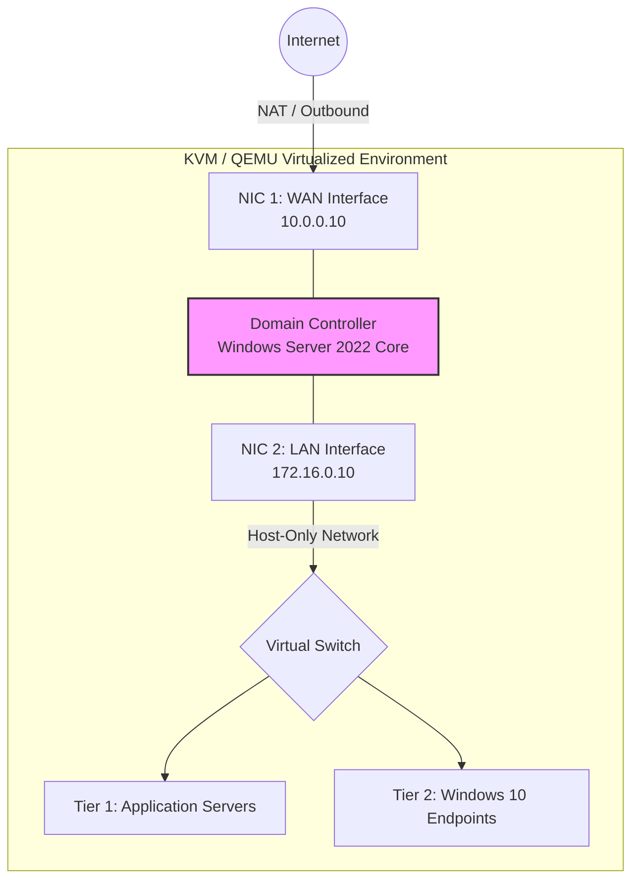

### Active Directory Tiering Model (OU Structure)
Administrative privileges are segregated into completely isolated Tiers, preventing credential overlap and lateral movement. The full hierarchy was deployed via IaC in a single script run.

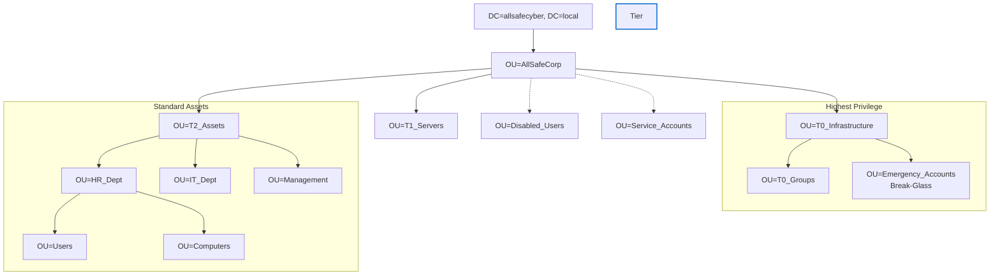

### RBAC & NTFS Isolation
NTFS inheritance is explicitly broken at the share root ("Deny by Default"). Access is granted only through department security groups assigned during automated provisioning — cross-department access is blocked at the kernel level.

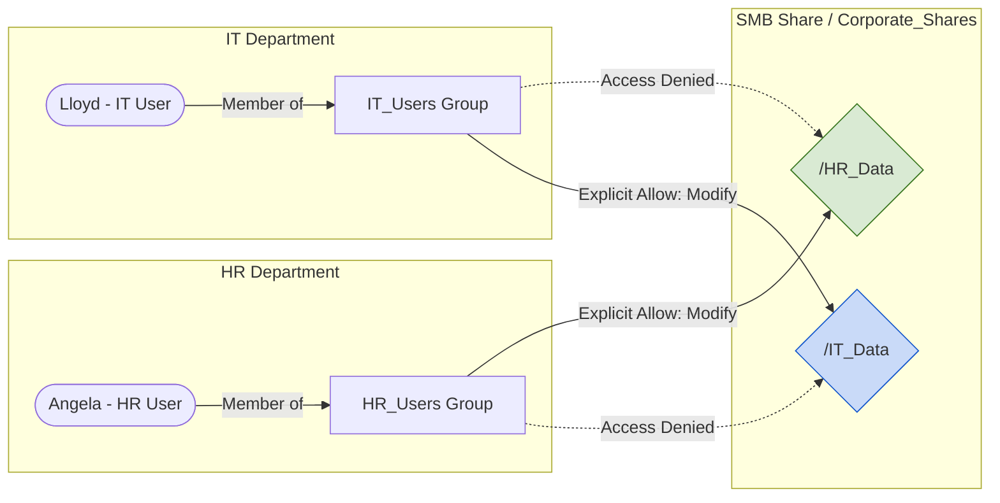

---

## Threat Model

Each security control in this lab was chosen to defeat a specific, documented attack pattern. The table below maps control → threat → reasoning.

| Attack | Control | How It Mitigates |
|---|---|---|
| **Pass-the-Hash / Credential Theft** | T0/T1/T2 Tiering (Enterprise Access Model) | T0 admin credentials are never cached on Tier 2 endpoints. Even if a workstation is fully compromised and memory is dumped, the extracted hashes cannot authenticate against the Domain Controller. |
| **Lateral Movement** | NTFS Deny-by-Default (broken inheritance + group ACLs) | A compromised Tier 2 account hits a kernel-level `Access Denied` on every share outside its own department. Horizontal file-system movement is blocked regardless of network access. |
| **Living off the Land (LotL)** | GPO: CMD, Regedit, PowerShell disabled for standard users | Removes the native tools most commonly abused in post-exploitation. Attackers cannot execute arbitrary commands, modify registry keys, or run scripts without dropping specialised malware — raising the cost of the attack significantly. |
| **Brute-Force / Password Spraying** | Global Identity Hardening GPO (14-char min, lockout policy) | Enforces a domain-wide password policy that defeats most automated credential attacks. Short or reused passwords are rejected at provisioning time. |
| **Privilege Escalation via Default Accounts** | Break-Glass isolation (`emg_recovery` renamed, T0-isolated) | The built-in Administrator account — the primary target of most privilege-escalation tooling — does not exist under its default name or in an accessible OU. |
| **Undetected Execution on DC** | T0 Audit GPO (Event ID 4688 + command-line logging) | Every process spawned on the Domain Controller is logged with full command-line arguments. Blue Team analysts have forensic-grade visibility into attacker commands. |
| **USB-Based Exfiltration / Malware Delivery** | T2 CIS Baseline GPO (USB removable storage disabled) | Physical storage is blocked at Group Policy level on all Tier 2 endpoints, removing a common data-exfiltration and initial-access vector. |

---

## Technologies & Core Concepts

* **Infrastructure & Virtualization:** KVM/QEMU, `libvirt`, `virt-manager`, Isolated Host-Only Networking.
* **Operating Systems:** Windows Server 2022 (Server Core Edition) for Tier 0, Windows 10 Enterprise for Tier 2 endpoints.
* **Identity & Provisioning:** Active Directory Domain Services, Infrastructure as Code via PowerShell.
* **Security & Access Control:** Role-Based Access Control, NTFS & SMB Cryptographic Isolation (*Deny by Default*).
* **Security Frameworks:** Zero Trust Architecture (NIST SP 800-207), Microsoft Enterprise Access Model, Group Policy Object Hardening and Auditing.

---

## Repository Structure

* `automation-scripts/`: Deployment scripts for Active Directory forest, multi-tier OU architecture and automated user onboarding.
    * `01_InitialSetup.ps1`: - Network, DNS and SSH configuration.
    * `02_DeployForest.ps1`: - AD DS installation and DHCP/NAT routing.
    * `03_GetADInfo.ps1`: - Forest and Domain verification.
    * `04_CreateTestUser.ps1`: - Initial validation of identity creation.
    * `05_BuildArchitecture.ps1`: - Deployment of Tier 0/1/2 OUs and RBAC groups.
    * `06_MoveInitialUsers.ps1`: - Securing built-in accounts (renaming default Admin to Break-Glass) and migrating initial assets.
    * `07_AutomaticUserCreation.ps1`: - Bulk user provisioning via CSV.
    * `08_FileSharing.ps1`: - Zero Trust file shares and NTFS ACL configuration.
    * `employees.csv`: - Dummy HR data for bulk provisioning.
* `hardening-scripts/`: Group Policy Objects (GPO) deployed as code for endpoint hardening and advanced auditing.
    * `GlobalIdentityHardening_GPO.ps1`: Enforces strict password complexity, length and lockout thresholds at the domain root.
    * `New-T0AuditVaultGPO.ps1`: Enables high fidelity logging (Event ID 4688 & Command Line visibility) for Tier 0.
    * `New-T2BaseLineGPO.ps1`: Deploys CIS baseline configurations (15-minute screen lock, USB storage deny) for T2 endpoints.
    * `New-T2RestrictionsGPO.ps1`: Mitigates LotL attacks by disabling CMD, Regedit and PowerShell for non-technical departments.
* `docs/`: Core architectural documentation, original thesis document and executive summary.
* `screenshots/`: Visual proofs of security policies blocking lateral movement, Active Directory structure and validation tests.

---

## System Requirements

To replicate this enterprise lab environment, your hypervisor host must meet the following requirements:

**Hardware Requirements:**
* **CPU:** 4 Cores (Intel VT-x / AMD-V enabled)
* **RAM:** 16 GB (Recommended to run the Domain Controller and Tier 2 Client smoothly)
* **Storage:** ~60 GB for virtual disks

**Software & Hypervisor Stack:**
* **Host OS:** Linux (Arch/Debian/Fedora) with **KVM/QEMU** and `libvirt` daemon running.
* **Management UI:** `virt-manager`
* **Guest ISOs:** *Windows Server 2022 (Evaluation) - Deployed as **Server Core**.
                  *Windows 10 Enterprise (Evaluation) - Deployed as Tier 2 Client.
* **Networking (Dual-Homed Architecture):**
    * **NIC 1 (External/WAN):** Connected to a NAT interface for outbound internet access
    * **NIC 2 (Internal/LAN):** Connected to an isolated Host-Only virtual network, routing traffic strictly to Tier 1 and Tier 2 endpoints.

---

## Installation & Deployment Guide

Follow these steps to deploy the infrastructure as code:

### Step 1: Hypervisor & OS Setup

1. Create an isolated virtual network in `virt-manager`.
2. Provision the Domain Controller VM and the Tier 2 Client VM.
3. Ensure both machines are connected to the isolated network.

### Step 2: Infrastructure provisioning & Initial Verification

On the Windows Server Core machine, open a PowerShell Terminal with Administrator privileges and execute the deployment scripts in order:

```powershell
# 1. Set static IP (Dual-Homed) and configure DNS
.\automation-scripts\01_InitialSetup.ps1

# 2. Install AD DS Role, promote the forest and configure DHCP/NAT Routing
.\automation-scripts\02_DeployForest.ps1

# 3. Verify Domain and Forest Integrity
.\automation-scripts\03_GetADInfo.ps1

# 4. Create an initial test user to validate Active Directory functionality
.\automation-scripts\04_CreateTestUser.ps1
```

### Step 3: Architecture Deployment & Identity Routing

```powershell
# 5. Build the Enterprise Access Model (Tier 0, 1, 2 OUs and RBAC Groups)
.\automation-scripts\05_BuildArchitecture.ps1

# 6. Secure defaults: Rename built-in Administrator, disable test accounts and isolate T0/T2 assets
.\automation-scripts\06_MoveInitialUsers.ps1

# 7. Ingest HR Data (employees.csv), create user objects and route them to departmental OUs
.\automation-scripts\07_AutomaticUserCreation.ps1

# 8. Create Root Share, apply Zero Trust NTFS ACLs and block inheritance
.\automation-scripts\08_FileSharing.ps1
```

### Step 4: Security Hardening (GPO Deployment)

```powershell
# 9. Deploy Global Password Policies and Tier 0 Advanced Auditing (Event ID 4688)
.\hardening-scripts\GlobalIdentityHardeningGPO.ps1
.\hardening-scripts\New-T0AuditVaultGPO.ps1

# 10. Restrict Tier 2 Assets (Baseline CIS configs & restrict CMD/Regedit/PowerShell)
.\hardening-scripts\New-T2BaselineGPO.ps1
.\hardening-scripts\New-T2RestrictionsGPO.ps1
```

---

## Key Implementation Features

### 1. Automated Infrastructure as Code
Manual Active Directory setup is prone to human error. This project uses precise scripting (`05_BuildArchitecture.ps1`) to generate an advanced enterprise OU hierarchy including specialized containers like Break-Glass, Service_Accounts, T0/T1/T2_Groups alongside department-specific sub-OUs.

### 2. Securing Built-in Defaults & Identity Isolation
A major vulnerability in standard deployments is leaving default accounts exposed. The `06_MoveInitialUsers.ps1` script proactively mitigates this by renaming the built-in `Administrator` to `emg_recovery` (Break-Glass Account), disabling temporary test users and isolating critical Domain Admins into the Tier 0 Vault.

### 3. Bulk User Provisioning & RBAC Isolation
The `07_AutomaticUserCreation.ps1` script ingests external HR data (`employees.csv`), dynamically generates standardized credentials and routes identities directly to their appropriate Tier 2 department. Folder access rights are created with the `08_FileSharing.ps1` script that uses a **Deny by Default** strategy: NTFS inheritance is completely broken via code, restricting cross-department data exposure.

### 4. Domain & Endpoint Hardening 

To establish a robust security posture, Group Policy Objects (GPOs) are layered across the environment based on the Tiering Model:
* **Global Identity Security:** The `GlobalIdentityHardening_GPO.ps1` script enforces strict password complexity, minimum length (14 characters) and lockout thresholds at the domain root to prevent brute-force attacks.
* **Tier 0 Auditing:** High-fidelity logging, specifically Event ID 4688 with command-line visibility, is enforced on Domain Controllers (`New-T0AuditVaultGPO.ps1`) for Blue Team forensic analysis.
* **Tier 2 CIS Baselines:** The `New-T2BaselineGPO.ps1` script applies Center for Internet Security (CIS) recommendations, including enforcing 15-minute screen locks and disabling USB removable storage on standard endpoints.
* **Attack Surface Reduction (LotL Mitigation):** To neutralize *Living off the Land* techniques, `New-T2RestrictionsGPO.ps1` restricts non-technical departments from executing `cmd.exe`, administrative PowerShell modules, and the Registry Editor.

---

## Validation & Test Scenarios

The screenshots below are live captures from the deployed lab, validating each security control against real policy enforcement.

### Active Directory Structure
The deployed OU hierarchy, confirming Tier 0/1/2 separation and the Break-Glass Emergency Account isolation.

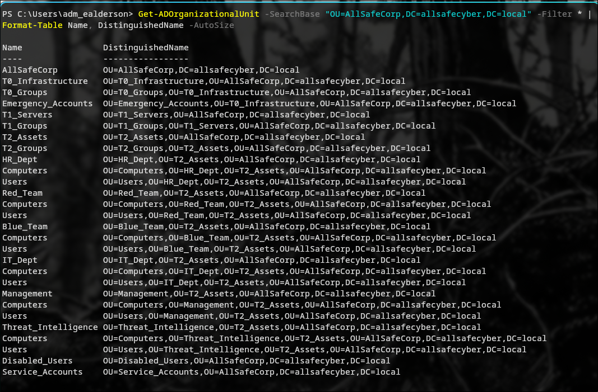

### Password Policy Enforcement
The Global Identity Hardening GPO applied at the domain root — 14-character minimum length, complexity requirements, and lockout thresholds.

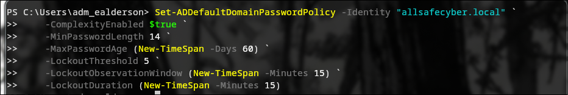

### Living off the Land (LotL) Mitigation
Standard Tier 2 users attempting to launch native attacker tools are blocked immediately by Group Policy — no malware or AV required.

**CMD.exe blocked:**

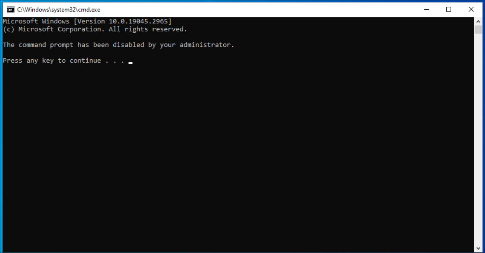

**Regedit blocked:**

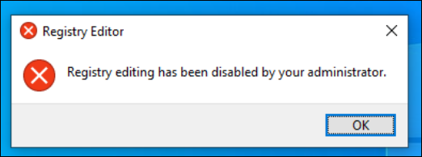

**PowerShell restricted:**

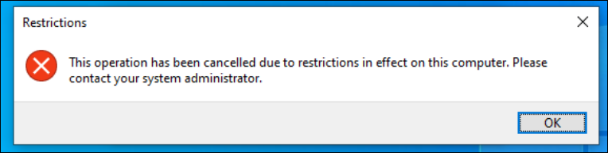

### Data Exfiltration Prevention (RBAC / NTFS)
Cross-department file access triggers a kernel-level `Access Denied` block. The NTFS ACL is enforced before any application logic runs.

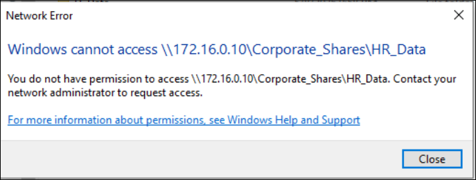

### Tier 0 Audit Policy (Blue Team Forensics)
Event ID 4688 with command-line visibility enabled on the Domain Controller. Every process spawned on Tier 0 infrastructure is logged for forensic analysis.

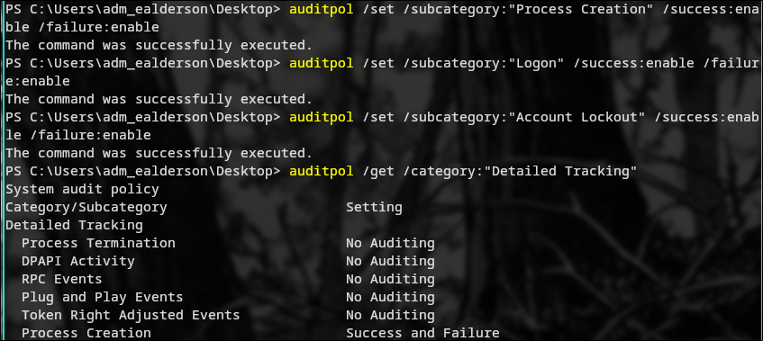

### Tier 2 CIS Baseline
Hardware controls applied to standard endpoints — USB removable storage disabled, 15-minute screen lock enforced.

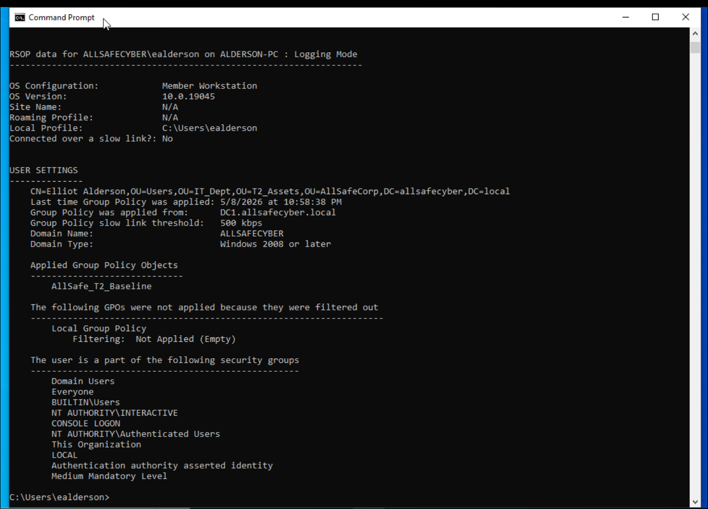

---

## Engineering Lessons

During development, a critical native limitation of Windows security automation via pure PowerShell was analyzed. Attempts to fully automate Tier 0 administrative account isolation, specifically modifying *User Rights Assignment* policies such as *Deny log on locally*, through direct scripting or registry overrides failed.

*Analysis:* These central security components are tightly bound to the Local Security Authority (LSA) database (`secedit.sdb`). The operating system purposefully ignores standard configuration scripts or registry injections to protect database integrity. In production, this highlights the necessity of using native Group Policy Management Consoles (GPMC) or lower-level configuration engines (like `.inf` template compilation through `secedit.exe`) to guarantee policy enforcement, proving that robust security always requires rigorous out-of-band validation.
