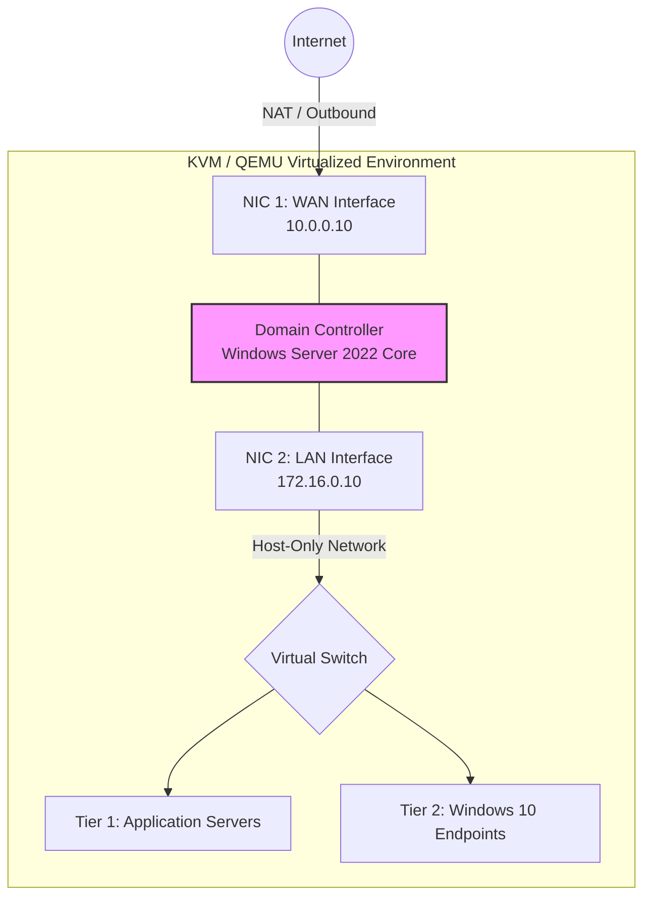
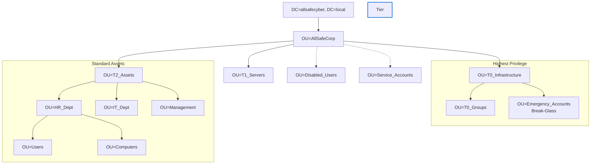
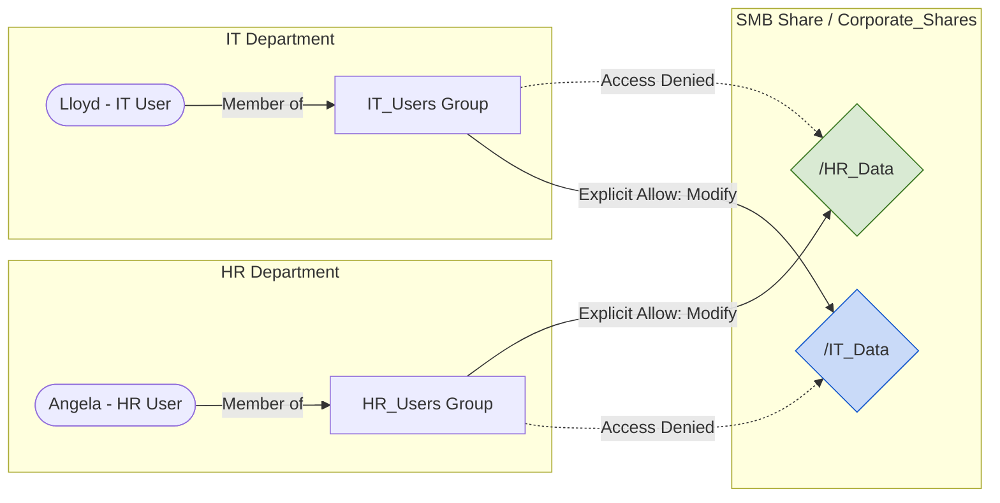

# Security Architecture & Network Topology

This document visualizes the core architectural concepts implemented in the **AllSafeCorp** Zero Trust lab environment. The diagrams below illustrate the network boundaries, the Active Directory structural hierarchy, and the cryptographic isolation applied to file shares.

---

## 1. Dual-Homed Network Topology
To prevent direct internet exposure for standard endpoints, the environment utilizes a Dual-Homed Domain Controller. The DC acts as a choke point (router/NAT) between the external network and the isolated Host-Only LAN where Tier 1 and Tier 2 assets reside.

---

## 2. Active Directory Tiering Model (OU Structure)
The Active Directory structure is strictly aligned with the Microsoft Enterprise Access Model. Administrative privileges are segregated into completely isolated Tiers, preventing lateral movement and credential overlap. The deployment was fully automated via Infrastructure as Code (IaC).

---

## 3. Role-Based Access Control (RBAC) & NTFS Isolation
To enforce the Zero Trust principle of **Least Privilege**, file system inheritance is broken at the root level ("Deny by Default"). Access is explicitly granted through security groups dynamically assigned during the automated provisioning phase.

